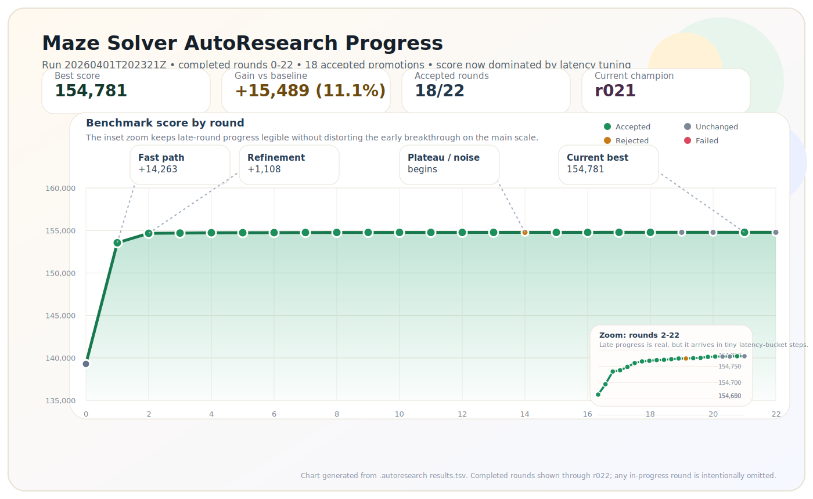

# Codex-AutoResearch

Codex-AutoResearch is a small Python CLI that runs Codex in a loop against a
target repository, evaluates one candidate at a time, and only commits changes
when they beat the current champion score.

The project is intentionally flat: the main implementation lives in `run.py`.

## Example Run

Here is a real run on the hardened maze benchmark from
`examples/maze_solver`. The first few rounds found the major algorithmic
improvement; the later rounds mostly shaved latency while preserving exact
benchmark quality.



## Commands

- `codex-autoresearch init --repo /path/to/repo`
- `codex-autoresearch run --repo /path/to/repo`
- `codex-autoresearch status --repo /path/to/repo`
- `codex-autoresearch report --repo /path/to/repo`

Target repos use:

- `program.md` for human-written guidance
- `config.toml` for loop and evaluator settings
- `init` prepopulates both files with starter content, and `config.toml` includes comments
- `.autoresearch/results.tsv` as an append-only experiment log across runs

## Example

Assume you have a repo at `/tmp/demo-repo` with some code and a command that
prints a score like `AUTORESEARCH_SCORE=123`.

Initialize the repo for Codex-AutoResearch:

```bash
python3 run.py init --repo /tmp/demo-repo
```

If you skip `init` and call `run` first, the tool will scaffold missing
`program.md` and `config.toml`, then stop so you can edit them.

Edit `/tmp/demo-repo/program.md`:

```md
# Mission
Improve the benchmark score without breaking existing behavior.

## Goal
- Make the app faster.

## Constraints
- Do not change the public API.
- Keep the project runnable with the existing commands.

## Strategy
- Prefer small, focused improvements.
```

Edit `/tmp/demo-repo/config.toml`:

```toml
# Codex execution settings.
[codex]
# Path to the Codex CLI binary.
binary = "codex"
# Optional model override. Leave empty to use the CLI default.
model = ""
# Extra CLI args passed through to `codex exec`.
extra_args = []

# Loop stopping conditions.
[search]
# Maximum number of candidate rounds to try.
max_rounds = 5
# Maximum wall clock time for a run, in minutes.
max_wall_time_minutes = 60
# Stop after this many non-improving rounds in a row.
max_stagnation_rounds = 3

# How the harness evaluates a candidate branch.
[evaluator]
# Commands run after each Codex attempt. All must exit with code 0.
commands = ["python3 benchmark.py"]
# Regex used to extract the numeric score from evaluator output.
score_regex = "AUTORESEARCH_SCORE=(?P<score>-?[0-9]+(?:\\.[0-9]+)?)"
# Use `maximize` when bigger is better, `minimize` when smaller is better.
direction = "maximize"

# Git and artifact layout.
[git]
# Optional base branch override. Leave empty to auto-detect.
base_branch = ""
# Directory inside the target repo where logs, state, and worktrees are stored.
artifacts_dir = ".autoresearch"
```

Run the loop:

```bash
python3 run.py run --repo /tmp/demo-repo
python3 run.py status --repo /tmp/demo-repo
python3 run.py report --repo /tmp/demo-repo
```

What happens:

- The tool creates a baseline score from the current branch.
- For each round, it creates one candidate branch and one git worktree.
- It asks Codex to make one focused improvement attempt.
- Each attempt must return a `hypothesis` describing what the experiment is trying.
- It runs your evaluator command.
- If the score improves, it commits the candidate and makes it the new champion.
- If the score does not improve, it deletes the candidate branch and tries again next round.
- The full experiment log is fed back into the next prompt, and exact repeated hypotheses are rejected as duplicates.
- `run` stays in the foreground and shows one live status line with elapsed time, idle time, the current phase, and cumulative input/output token usage streamed from Codex session files when available.
- When a phase finishes, `run` prints a durable line showing how long it took, so you can see the rhythm of each round without duplicating the live status line.
- If the latest run already completed or stopped, `run` starts a fresh run automatically from the last committed champion and keeps using the full experiment history in `.autoresearch/results.tsv`.

Artifacts are written under `/tmp/demo-repo/.autoresearch/`.
The main cross-run log is `/tmp/demo-repo/.autoresearch/results.tsv`.

## Notes

- The target repo can be created automatically if it does not exist yet.
- If the target repo is missing git, `init` and `run` will initialize it.
- The target repo must be clean before `run` starts.
- This project uses the Python standard library plus `tomli` on Python versions older than 3.11.
- To actually run experiments, you still need `git` and the Codex CLI installed, or another compatible binary configured via `config.toml` under `[codex].binary`.
